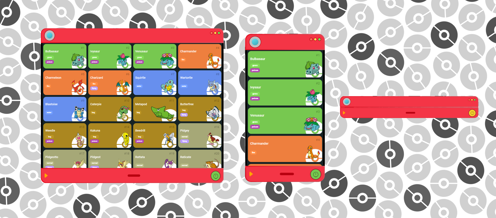

<h1 align="center"> POKEDEX </h1>

  <a href="#projeto ">Projeto</a>&nbsp;&nbsp;&nbsp;|&nbsp;&nbsp;&nbsp;
  <a href="#tecnologias">Tecnologias</a>&nbsp;&nbsp;&nbsp;|&nbsp;&nbsp;&nbsp;
  <a href="#layout">Layout</a>

  

  

## PROJETO
Esse projeto o qual desenvolvi junto ao Bootcamp de Desenvolvimento Frontend com Angular da [DIO](https://web.dio.me/), foi desevolvido com o objetivo de simular uma pokedex, e para isso além de conhecimentos base como HTML, CSS e JavaScript, foi ultilizamos também a Api [PokeApi](https://pokeapi.co/), que nos fornecem dados com imagens, nomes, tipos e entre outros diversos dados relacioados aos pokemos. [ACESSE O PROJETO AQUI](https://65a90cef9d5d2500089d6408--incredible-melba-5e3292.netlify.app).

## LAYOUT

O layout em tese ficou a criterio de cada aluno, então desenvolvi um layout baseado na pokedex classica do anime. Visualize o LayOut do projeto através [DESSE LINK](https://www.figma.com/file/uTscCBZwAak9atGX3l4mOV/Untitled?type=design&node-id=1%3A2&mode=design&t=sTzo3BC9lUSIV7C3-1). E para acessá-lo é necessário ter um conta no [FIGMA](https://figma.com).

 

### TECNOLOGIAS 

   

   

   
  
   

  

  

